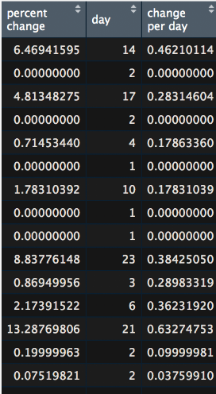
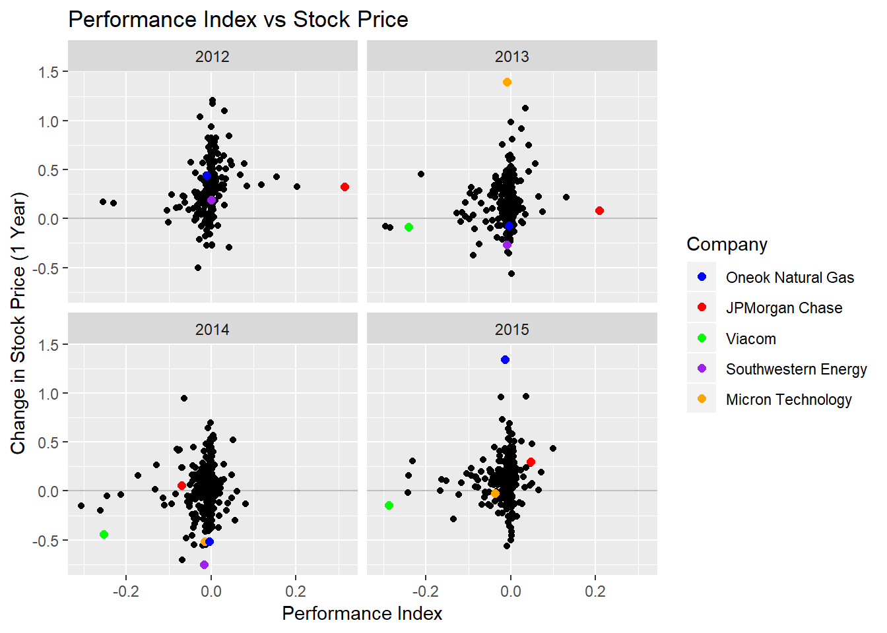

# **Stock Analysis With R** 

### **The Motivation**

Nowadays it seems like there is a renewed attention in the stock market and investing in general. It seems like everyday you hear more and more about something a company did and how it will be the downfall of the company. The very next week, the same people that were predicting the downfall of the company, are talkng about how it's undervalued and its price is going to soar. Demonstrating to us that even the experts really don't know for sure.  

The renewed interest in the market is even evident among millenials, as demonstrated by the explosion of mobile investing apps. There's a range of them that are made to appeal to people with a wide variety of financial knowledge/experience. 

Robinhood is by far the most popular app as it offers free stock and options trading. However, Robinhood does not come with the advanced news and charting features that paid competitiors such as Think or Swim come with.

Betterment is also another popular investment app. It takes a fee, but generally it is much smaller than what a traditional broker would charge. Betterment does not allow users to purchase individual stocks. Instead, the user contributes money to the app, and an algorithm allocates the money into mutual funds taking into account the amount of risk the user says they're willing to take. 

Consequently that led us to explore the following questions:
 
* Do the news stories about companies actually affect the price of a stock? Knowing this could help one make the decision whether or not to listen to the news, and whether or not they should use a tool that gives them more insght on the news surrounding a stock than Robinhod. 
 
* Does the value of a commodity affect the price of stocks in a similar market space? Knowing this could help a user make the decision whether or not to use Robinhood, or an app that allows for more streamlined comparisons of stocks. 

* Do popular technical indicators actually work? Knowing this could help one make the decision on whether or not they want to use Robinhood or an app that allows them to use to technical indicators to help predict value.

* How does company performance compare to their Stock Price? This cwould be interesting to see to determine how much weight to put on the news about them, and in determining the feasability of using an algorithm to manage your money. 

* Can we predict the price of a stock on a future date? There are strong arguments on both sides of this question, so we decided to test it for ourselves and draw our own conclusions. 

### The Datasets 
<br>
The datasets we used in this investigation were obtained from Yahoo Finance using the quantmod package and from a New York Stock Exchange Kaggle dataset. The link to the datasets are below. 

[Yahoo Finance](https://finance.yahoo.com/)

[Quantmod Information](https://cran.r-project.org/web/packages/quantmod/index.html)

[Kaggle Dataset](https://www.kaggle.com/dgawlik/nyse/version/3#)

### **The Analysis**

### Stock price reaction to publicized events in the aviation industry.

```{r, message=FALSE, warning=FALSE}
library("dplyr")
library("tidyr")
library("tidyverse")
library("ggplot2")
library("readxl")
library("ggrepel")
library("RColorBrewer")
library("padr")
#https://cran.r-project.org/src/contrib/Archive/forecast/
#install.packages("~/Downloads/forecast_8.4.tar", repos = NULL)
#https://cran.r-project.org/src/contrib/Archive/quadprog/
library("tidyquant")
library("quantmod")
library('magrittr')

#Define start and End dates
start <- as.Date("2018-01-01")
end <- as.Date("2019-04-01")

getSymbols(c("BA", "EADSF", "SPY"), src="yahoo", from = start, to = end)

#On 29 October 2018, the Boeing 737 MAX 8 operating the route crashed into the Java Sea 12 minutes after takeoff, killing all 189 passengers and crew.
#On 10 March 2019, the Boeing 737 MAX 8 aircraft which operated the flight crashed near the town of Bishoftu six minutes after takeoff, killing all 157 people aboard.

ba_df <- data.frame(date=index(BA), coredata(BA)) %>% 
  mutate(BA.day_difference = (BA.High-BA.Low)/max(BA.Close)) %>%
  mutate(BA.scale_max = BA.Close/max(BA.Close)) %>%
  mutate(origin = "Boeing")
eadsf_df <- data.frame(date=index(EADSF), coredata(EADSF)) %>% 
  mutate(EADSF.day_difference = (EADSF.High-EADSF.Low)/max(EADSF.Close)) %>%
  mutate(EADSF.scale_max = EADSF.Close/max(EADSF.Close)) %>%
  mutate(origin = "Airbus")
colnames(ba_df) <- c("date", "Open", "High", "Low", "Close", "Volume", "Adjusted", 
                     "scale_diff", "scale_close", "origin")
colnames(eadsf_df) <-  c("date", "Open", "High", "Low", "Close", "Volume", "Adjusted", 
                     "scale_diff", "scale_close", "origin")
airplane_df <- rbind(ba_df, eadsf_df)

ggplot(airplane_df, aes(x=date, y=scale_close, color=origin))+
  coord_cartesian(xlim=c(start+20, end-20), ylim=c(0.66, 1))+
  geom_line()+
  scale_color_manual(values=c(Boeing="#0039a6", Airbus="#74d2e7"))+
  scale_x_date(date_labels = "%b %y", date_breaks = "1 month")+
  labs(title = "Stock Price Comparison of Boeing and Airbus",
       subtitle = "Adjusted for maximum relative price",
       y="proportional closing value",
       color="")+
  theme(axis.text.x = element_text(angle = 45, hjust = 1),
        panel.grid.minor = element_blank(),
        panel.grid.major = element_blank(),
        panel.border = element_rect(colour = "black", fill=NA, size=1),
        legend.position = c(0.885, 1.08),
        legend.direction="horizontal")+
  geom_vline(xintercept = as.Date("2018-10-29"), size=0.5, linetype="dotted")+
  geom_vline(xintercept = as.Date("2019-03-10"), size=0.5, linetype="dotted")+
  annotate("text", x=as.Date("2018-10-29"), 
           y=0.65, label="Lion Air 737 Max 8", angle=90, vjust=-0.5, hjust=0, size=3)+
  annotate("text", x=as.Date("2019-03-10"), 
           y=0.65, label="Ethiopian Airlines 737 Max 8", angle=90, vjust=-0.5, hjust=0, size=3)

ggplot(airplane_df, aes(x=date, y=scale_diff, color=origin))+
  coord_cartesian(xlim=c(start+20, end-20), ylim=c(0, 0.085))+
  geom_line()+
  scale_color_manual(values=c(Boeing="#0039a6", Airbus="#74d2e7"))+
  scale_x_date(date_labels = "%b %y", date_breaks = "1 month")+
  labs(title = "Stock Price Volatility of Boeing and Airbus",
       subtitle = "Adjusted for maximum relative price",
       y="proportional daily volatility",
       color="")+
  theme(axis.text.x = element_text(angle = 45, hjust = 1),
        panel.grid.minor = element_blank(),
        panel.grid.major = element_blank(),
        panel.border = element_rect(colour = "black", fill=NA, size=1),
        legend.position = c(0.885, 1.08),
        legend.direction="horizontal")+
  geom_vline(xintercept = as.Date("2018-10-29"), size=0.5, linetype="dotted")+
  geom_vline(xintercept = as.Date("2019-03-10"), size=0.5, linetype="dotted")+
  #MAX 8 crash dates
  annotate("text", x=as.Date("2018-10-29"), 
           y=0.0875, label="Lion Air 737 Max 8", angle=90, vjust=-0.5, hjust=1, size=3)+
  annotate("text", x=as.Date("2019-03-10"), 
           y=0.0875, label="Ethiopian Airlines 737 Max 8", angle=90, vjust=-0.5, hjust=1, size=3)+
  #trade volatility inflection points of interest
  annotate("text", x=as.Date("2018-02-05"), 
           y=ba_df[ba_df$date == as.Date("2018-02-05"), 8], label="A", vjust=-0.5, hjust=0.5, size=3)+
  annotate("text", x=as.Date("2018-04-24"), 
           y=ba_df[ba_df$date == as.Date("2018-04-24"), 8], label="B", vjust=-0.5, hjust=0.5, size=3)+
  annotate("text", x=as.Date("2018-11-20"), 
           y=ba_df[ba_df$date == as.Date("2018-11-20"), 8], label="C", vjust=-0.5, hjust=0.5, size=3)+
  annotate("text", x=as.Date("2018-12-26"), 
           y=ba_df[ba_df$date == as.Date("2018-12-26"), 8], label="D", vjust=-0.5, hjust=0.5, size=3)
```

The impact of real-life events on the stock market was investigated using the recent Boeing controversy involving two plane crashes as focus points. The investegation involved Boeing as the primary publicized target and Airbus, a related stock that is Beoing's primary competitor in the aviation industry. Two plots were created, each with the same x-axis date range. Vertical lines were used to designate the precise day on which the two plane crashes occurred. Percent change is an ideal metric of measuring stock value trends. Both graphs were scaled proportionally to maximum observed corresponding stock value. The maximum value of Boeing stock ($446) was nearly four times greater than Airbus stock max ($136).

Observing the Stock Price Comparision plot, a trend is not immediately clear following the first crash of Lion Air 737 Max 8 on Oct. 29, 2018. It appears the market as a whole was in a depreciatory state. Both Boeing and Airbus lost comparable stock value for several months before the trend reversed. It wasn't until the second crash of Ethiopian Airlines 737 Max 8 on Mar. 10 2019 that there was a substantial reaction in the stock market corresponding. Shortly after the crash, corresponding to the time at which Boeing divulged a software failure responsible for both crashes, Boeing stock dropped by nearly 18%. In comparison, Airbus stock experienced a sudden positive spike on the same day.

To provide additional evidence that the observed stock trends were directly related to real-life events, a Stock Price Volatility plot was created. Volatilty indicates the difference between the maximum and minimum stock values on any given day, scaled proportionally to the maximum observed corresponding stock value in the date range. Sharp inflection points indicate days at which stock price grew or fell quickly. The plot isn't able to differentiate positive and negative growth. Airbus stock price was stable relative to Boeing. Airbus is a European company traded predominantly overseas. On the New York Stock Exchange, the stock volume of Airbus relative to Beoing is nearly 1000 times less. For this reason, Airbus stock volatility not considered. 

It is clear that the greatest inflection points match the dates of the two plane crashes. Several additional inflection points were selected for reference, labeled "A-D". Point A was the day on which Boeing deputed its 737 Max 7. Ryanair ordered 25 737 MAX 8s from Boeing at point B. Point C related to the first plane crash; Boeing canceled a conference call with airlines to discuss systems on the 737 Max model. The last point, D, was the day Boeing introduced the Defiant helicopter, which has twice the speed and range of conventional helicopters. Admittedly, these events were selected for on the basis of a given date. They represent the most significant, Boeing-related events on days of notable stock price volatility. Each point appears substantial enough to motivate a response from investors. It is reasonable to conclude that stock price values are tied directly to publicized events. Therefore having access to more news sources could be beneficial when following a stock.

### Comparing AMD and Nvidia With the Rise and Fall of Bitcoin

We wanted to take a look at two competing companies, Nvidia and AMD, and see what happened to their stock prices when outside forces impacted their marketplace. The outside force chosen here was the shortage of GPUs do to the rise in cryptocurrency mining in the first half of 2018.

The process of mining cryptocurrency involves solving increasingly complex calculations on a machine in order to generate new coins and to uodate the blockchain that serves as the currency ledger. As a currency matures, miners need increasingly more powerful mining rigs with enough processing power to generate a profit from the coins. When Bitcoin and other cryptocurrencies became truly lucrative in 2017, the large influx in miners led to a dramatic increase in the demand for Nvidia and AMD GPUs. The law of Supply and Demand took over, and the selling price of most of the GPUs on the market skyrocketed, in some cases double the MSRP. 

At the beginning, this increase in sales led to a spike in the stock prices of both companies. However, the lack of supply and a decrease in the demand from the mining sector soon proved to be a problem. 

The end of summer 2018 saw a massive decrease in the demand for new GPUs from coin miners. The cost of coninuously mining cyrptocureency had overcome the profit turned from the mining, and many left the scene. The problem for Nivdia and Amd here was that the prices of the GPUs on the market could not correct themselves fast enough to keep up with the decrease in sales. As a result, no one could or would buy their products. This led to the stock price for each company to plummet. From September to November, shares fell for both companies. Nvidia managed to los 54% of their stock value in Q4 of 2018 alone. 

```{r setup, message=FALSE, warning=FALSE}
library(quantmod)
library(ggplot2)
library(plotly)
library(forecast)
```

```{r NVDA AMD, message=FALSE, warning=FALSE}
start <- as.Date("2018-07-01")
end <- as.Date("2019-01-01")

getSymbols(c("AMD", "NVDA"), src="yahoo", from = start, to = end)

stocks <- as.xts(data.frame(nv = NVDA$"NVDA.Close", amd = AMD$"AMD.Close"))

plot(as.zoo(stocks$"NVDA.Close"),screens = 1,lty = 1,main="Closing Prices of Nvidia, AMD", col = "red" ,xlab = "Date, July 2018 - January 2019",ylab = "Close Price, USD") 
#  geom_vline(xintercept = as.Date("2018-09-01"), size=0.5, linetype="dotted")
par(new = TRUE)
plot(as.zoo(stocks$"AMD.Close"),screens = 1,lty = 2,col = "blue" ,xlab = "",ylab = "", xaxt = "n", yaxt = "n")
abline(v = as.Date("2018-09-01"), lty = 2)
axis(4)
mtext("Price", side = 4, line = 3)
legend("topleft",c("Nvidia(left)","AMD(right)"),lty = c(1,2),cex = 0.5)
```

This graph shows the stock prices for Nvidia and AMD from July, 2018 to January, 2019. We can see the fluctuation in the stock prices for both companies here. Since the share price for Nvidia is much higher than that of AMD, each line is scaled individually on the graph. From here, we can clearly see the correlation between the decline in cryptocurrency mining and the drop in the stock prices. So it is reasonable to assume that it is useful to have a platform that allows for side by side comparisons of equities.  

### Testing the Effectiveness of Bollinger Bands

Given that Robinhood does not have technical indicators, I wanted to test the effectiveness of Bollinger Bands to see if they really work. If they don't work, then it's no issue that Robinhood does not have them. If they do, then it might be worth looking at a different platform. 

Bollinger Bands work based on the moving average, meaning that the oldest value is dropped when a new one is added. The top band is 1 standard deviation above the moving average, the middle band is the moiving average, and the bottom band is 1 standard deviation below the moving average. 

A popular strategy is to sell or enter a position that profits from a stock decreasing when the price goes down hitting the moving average. 

We decided to look at SPY which is an ETF representation of the S&P 500. this allows us to generalize if it works for stocks that make up what is essentially the overall market. 

To test this we decided to use the following code to highlight everytime the stock dips below the moving average. To give us a conceptual visual understanding of what we are looking at. 

#### Highligting the Dips Below the Moving Average
```{r message=FALSE, warning=FALSE}
spy_df <- data.frame(date=index(SPY), coredata(SPY)) %>% 
  mutate(SPY.day_difference = SPY.High-SPY.Low) %>%
  mutate(SPY.scale_max = SPY.Close/max(SPY.Close))

bband_n <- 20
spy_df <- mutate(spy_df, SPY.SMA = SMA(unlist(spy_df[,2]), n=bband_n)) %>% 
  #mutate(below_SMA = SPY.Close < SPY.SMA)
  mutate(below_SMA = ifelse(SPY.Close < SPY.SMA, 1000, 0))

pad_spy_df <- spy_df %>% pad
keep_SMA <- 0
for (row in 1:nrow(pad_spy_df)) {
  SMA <- pad_spy_df[row, "below_SMA"]
  if(!is.na(SMA)) {
    keep_SMA <- SMA
  } else if(keep_SMA == 1000) {
    pad_spy_df[row, "below_SMA"] <- 1000
  }
}

ggplot(spy_df, aes(x = date, y = SPY.Close, open = SPY.Open, 
                  high = SPY.High, low = SPY.Low, close = SPY.Close))+
  coord_cartesian(expand=FALSE, xlim=c(start, end), #+48, end-22),
                  ylim=c(min(spy_df$SPY.Close)-10, max(spy_df$SPY.Close)+30))+
  geom_bar(data=pad_spy_df, aes(y=below_SMA), color="#ffb3b3", stat="identity", width=1)+
  geom_line(color="#0039a6")+ #geom_candlestick()+
  geom_bbands(ma_fun = SMA, sd = 2, n = bband_n)+
  labs(title = "SPY Chart", 
       subtitle = "BBands with SMA Applied", 
       y = "Closing Price", x = "date")+ 
  #theme_tq()
  scale_x_date(date_labels = "%b %y", date_breaks = "1 month")+
  ylab("closing value")+
  theme(axis.text.x = element_text(angle = 45, hjust = 1),
        panel.grid.minor = element_blank(),
        panel.grid.major = element_blank(),
        panel.border = element_rect(colour = "black", fill=NA, size=1))
```

We see here that often when the stock dips, that it rebound within a day or so. This is a bit misleading because we are looking at the stocks on a day by day timeframe. However, the market reacts much faster and even the times that it dips and rebounds, traders can make money. 

##### Table of Percent Change, Number of Days Below the Moving Average, and the Percent Change per Day
 


We also see that there are dips that are pretty significant. The largest dip was 13% as well as numerous other dips greater than 1%. This may not seem like a lot, but it is significicant given that banks often only give fractions of a percent in interest. Here we found that the mean percenage is 2.45% which is much greater. 

Paired with the fact that traders can make moeny on the dips that have a good rebound, it is safe to say that Bollinger Bands work. Thus having them would be useful, and usrers should explore other trading platforms that allow them to use technical indicators. 

### Comparing Company Performance to Changes in Stock Price

I imported a dataset from [Kaggle](https://www.kaggle.com/dgawlik/nyse/version/3#) that shows details about companies listed on the NYSE. I wanted to use this data set to find a correlation between the information from the data set and the change in price of a company's stock. I spent some time cleaning the data set and changing some strings to dates. I also added a row with the date each measurement was taken, since that information was originally in the index. I also added a new row that gave the date 1 year after the measurement was taken. I did this so I could easily access it later when telling the quantmod package what period to get information from. 

I created a function that takes an input of a stock symbol and returns the associated rows from the dataset along with the change in stock price over the year after each data point in the set was taken. I made this function to simplify the process of obtaining data for multiple company stocks. 

During my initial test of this function, I ran into some issues with errors coming from a few different inconsistencies within the data set, partly due to some measurements being taken on weekends, when stock price information is not available. Dealing with all of these issues would have been very difficult, so I opted instead to simply filter out the companies whose data contained inconsistencies. Overall, I had to get rid of data from 165 different companies. However, I kept the data from 283 companies, and each company provided 4 data points to compare to, so I believe I still had a large enough data set to gather some useful information. 

I used the LEAPS package and forward subset selection to determine which 5 variables had the biggest effect on the stock's performance the next year. The top 5 variables were:
1) Fixed Assets
2) Changes In Inventories
3) Effect of Exchange Rate
4) General and Admin Sales
5) Net Income

##### Plots of Performance Index vs Stock Price


I created a new variable which is a linear combination of the five most important variables above, and called it the 'Performance Index'. I then plotted the Performance Index against the change in stock price over the next year. It looks a bit messy at first, but I think there is quite a bit of useful information we can get from these graphs. 

First, notice that there are many companies grouped around the center of the x-axis that tend to vary a lot on the y-axis. Smaller companies will tend to fall in this area, since they don't have large amounts of profit or loss that would change their performance index by a great amount. They have the highest variance on the y-axis because it would be easier for a small company to double in price than it would be for a large company. 

Also note that the companies with exceptionally high or low performance indexes tend to not vary as much in stock price. This makes sense, because a large company with an expensive stock won't be likely to double in price or drop by a large percentage. 

I also spent some time looking at the outliers to see if I could pinpoint a specific reason for the change in stock price or performance index. I highlighted some noteable companies and explored this question in the presentation. It is safe to say that having access to more in depth company data is useful when deciding whether to invest. Consequently, having the information on your trading platform would be a big advantage. 

### Predicting A Future Stock Price

There are a lot of factors that contribute the price of a stock and how it moves. Given the growing popularity of algorithmic apps such as Betterment, I wanted to see if it was possible to predict the price the future price of a stock. 

This results would allow users to decide for themselves as to whether or not they want to invest their money on a platform that is not traded by humans. 

I decided to test my hypothesis on the S&P500 because it is a generalization for many stocks. I also, checked that it had an overall positive trend, and that overall the stock was increasing. 

```{r message=FALSE, warning=FALSE}
#Getting the required libraries, we are assuming you already have them installed 
#If not you can install them from the CRAN using packages.install(<library name>)
library('quantmod')
library(tidyquant)
library('forecast')
library('ggplot2')

getSymbols("SPY", src="yahoo", from="2019-01-01", to="2019-04-27")
Returns <- diff(SPY$SPY.Close)/lag(SPY$SPY.Close, k=1)*1000
Returns<-fortify(Returns)

ggplot(Returns, aes(x=SPY.Close) )+
  geom_histogram(binwidth = 2, color="black",fill="white",center=0)+ 
  scale_x_continuous(breaks=seq(-26, 36, 2))+
  geom_vline(xintercept = 0, col = 'darkred')+
  scale_y_continuous(breaks=seq(-1, 18, 2))+
  ggtitle("Frequency of Daily Percentage Change")+
  xlab("Percentage Difference")+
  ylab("Number of Occurances")

```

We see that the percent change is pretty normally distributed and has slightly more days where it increases in prices vs when it decreases.  

To model it, I chose to use the ARIMA model as the basis for my prediction. I did so because it is widely used to predict time based values.  

The ARIMA Model is the AutoRegressive Moving Average. Meaning that it checks how much it correlates with itself, is based off of the moving average, and uses differencing to make the data stationary. I used 1 degree of differencing, meaning that instead of looking at the price of the stock, we looked at the difference in price relative to the previous day. 

I modeled the price of the stock using only data from this year because it would be the most relevant. I chose to use the auto arima function because it tries all of the ARIMA models and choses the best fit for our data. 

I then used the forecast package in R to try to estimate the price based on the modeled data. 

```{r message=FALSE, warning=FALSE}

arimaData <- auto.arima(SPY$SPY.Close)
fit.forecast <- forecast(arimaData)
fit.forecast

```


In 2019 there were 80 trading days from January 1st  to April 27th that we were able to use. The first 19 days were used to establish the moving average. With this data, we were able to predict that the price on the 81st day (April 29th) would be $293.83 at close. 

The actual closing value of the stock was $293.87. As you can see, our prediction was very accurate. Often small differences of a few cents can be attributed to the platform that is gathering the data. Many stock trading platforms will be within a few cents of each other and the difference ussually comes down to the speed of their order execution and what their last reported bid and offer were.  

With the success of our model, I would say that it is worth looking more into the effectiveness of algorithmic trading, perhaps with more stocks. We have seen that the algorithms can be effective, and if used on a larger scale, could be profitable. 

### **Our Conclusion**

Our research was mainly to satisfy curiosity. We wanted to explore what merits there might be to taking different approaches when going about the stock market. We advise the reader to take our analysis and exploration as a starting point to make their own decisions. The stock market is very complex and there is a reason why so many people have lost a lot of money in it. Any one who tells you that they have it figured it out, is lying. Even Warren Buffet lost $4 billion in a matter of hours earlier this year. There are a lot more questions that can be answered, and we hope this provides an idea of how to go about satisfying your curiosity. 


### **Our Sources**

https://boeing.mediaroom.com/2018-02-05-Boeing-Debuts-First-737-MAX-7

https://boeing.mediaroom.com/2018-04-24-Boeing-Ryanair-Announce-Order-for-25-737-MAX-8s

https://www.cnbc.com/2018/11/20/boeing-shares-fall-after-cancelling-conference-call-on-737-issues.html

https://www.defensenews.com/land/2018/12/26/heres-the-first-look-at-the-sikorsky-boeing-defiant-helicopter/

https://cointelegraph.com/news/following-crypto-mining-crash-gpu-producer-nvidia-worst-performer-in-sp-500

http://rstudio-pubs-static.s3.amazonaws.com/265813_dab79c8eb62d41e381a7e230465573ab.html

http://rstudio-pubs-static.s3.amazonaws.com/265813_dab79c8eb62d41e381a7e230465573ab.html

https://www.fool.com/investing/general/2014/01/13/how-micron-technology-plans-to-improve-top-line.aspx

https://dealbook.nytimes.com/2014/03/19/jpmorgan-to-sell-commodities-unit-for-3-5-billion/

https://stateimpact.npr.org/pennsylvania/2018/06/11/court-rejects-fracking-companys-appeal-in-rule-of-capture-decision/ 

https://cran.r-project.org/web/packages/tidyquant/vignettes/TQ04-charting-with-tidyquant.html

https://cran.r-project.org/web/packages/quantmod/index.html 

Data Science Cookbook By YuWei Chiu

### **Reflections**

#### Alex

I worked on the Bollinger Bands and Stock Prediction portions of the project. I also found the dataset and was the one who spoke with Dr Dai about getting the project approved. I coordinated our team meetings and efforts as well. I wanted to go more in depth with the analysis, but given that we had homeworks and labs up until the presentation was not able to. I also wanted to go more in depth in the presentation, as not everyone has the same financial background. However, I was not able to due to the time constraint. 

#### Blake

I compared significant publicized events directly related to the aviation industry to Boeing and Airbus stock prices. My contribution included all related plots and the written interpretation of the plots. I also created the SPY plot demonstrating Bollinger Bands and Simple Moving Average.

#### Sam

I contributed by analyzing the connection between company performance and change in stock price. I'm typically not a great public speaker, so I relied on my teammates to do well in the presentation. Because of this, I wanted my analysis to be very interesting. I decided to go with the correlation between company performance and stock price because it's a simple concept that most people can understand, but it's still a complex topic that has many avenues for analysis. 

#### Tim

My contribution to the project was the comparison between Nvidia and AMD. It wasn't the most in-depth or difficult analysis, but I was able to graph the stock prices for each company over time. Then, since I had prior knowledge of the Bitcoin blowup and the effect it had on Nvidia GPUs, I decided to look into what happened to each companies stocks over that specific timeframe. I actually found pretty much exactly what I expected - there was a very noticiable impact on both companies performances on the market. 

Since we didn't have any more time, both in the presentation and just in the class itself, I wasn't able to take the exploration much further. However, I do find the plenty interesting, and I think that I will look into stuff like this more in my own time later. 
